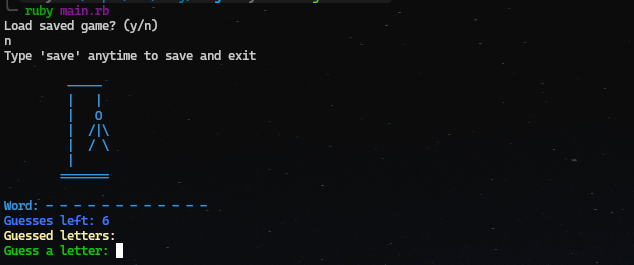

# 🎲 Hangman – Ruby CLI Edition

A command-line Hangman game built with Ruby. Guess the secret word letter by letter, but be careful — too many wrong guesses and you lose! Includes colorful prompts, word persistence, and the ability to save and resume your game.

## ✨ Features

- Single-player gameplay against the computer
- Random word selection from a dictionary file
- Tracks correct and incorrect guesses
- Shows remaining turns visually
- Input validation (only accepts single letters A–Z)
- Save and load functionality (resume where you left off)
- Clean, colorful command-line interface using the `colorize` gem
- Modular structure for readability and maintainability

## 📸 Gameplay Preview



## 🚀 Getting Started

### 1. Clone the Repository

```bash
git clone https://github.com/QUxPTA/TOP/tree/main/ruby/hangman
```

### 2. Install Dependencies

Ensure you have Ruby installed (ruby -v), then install gems:

`bundle install`

### 3. Run the Game

`ruby main.rb`

## 🧠 How to Play

- A random secret word is chosen at the start.
- You guess one letter at a time.
- Correct guesses are revealed in the word; incorrect guesses reduce your turns.
- The game ends when:
  - You guess the word correctly ✅
  - Or you run out of turns ❌
- 💾 You can also save your game mid-play and resume later.

## 🧱 Built With

- `Ruby`
- `colorize` – Adds color to CLI output
- `json` – For saving and loading game state
